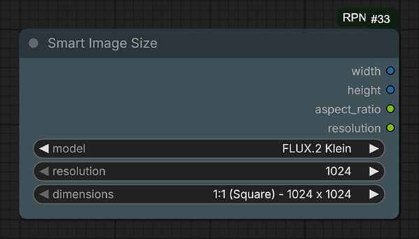
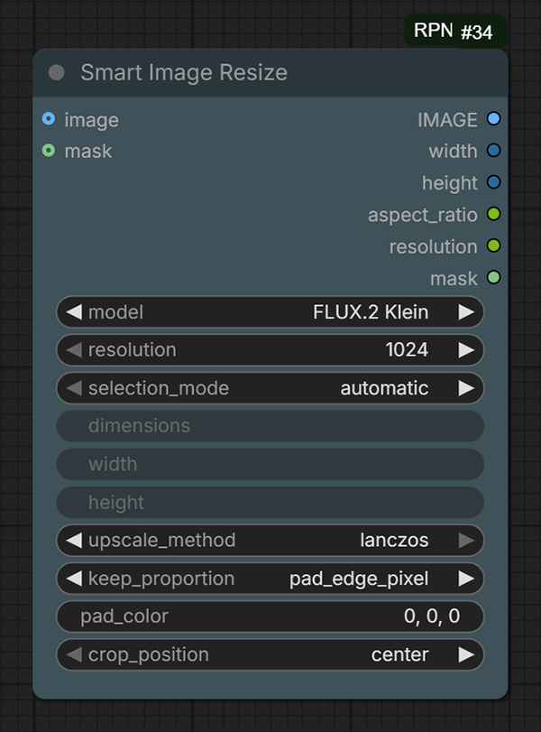

# ComfyUI RPNodes

A focused ComfyUI custom-node package for selecting model-aware image
resolutions and adapting images or masks to suitable dimensions for a chosen
image-generation model.

The package provides two nodes:

- **Smart Image Size**
- **Smart Image Resize**

Both nodes share the same resolution database. Model, resolution, and
dimensions menus are dependent: changing the model refreshes the available
resolution classes, and changing the resolution refreshes the available aspect
ratios and pixel dimensions.

## Supported models

- Boogu-Image-0.1 Base / Edit
- Boogu-Image-0.1 Turbo
- FireRed-Image-Edit-1.0
- FLUX.2 Klein
- HiDream-O1-Image / Dev
- Ideogram 4
- Krea 2
- Qwen-Image-2512
- Qwen-Image-Edit-2511
- SDXL
- Z-Image-Turbo

## Smart Image Size



Selects a model, a supported resolution class, and an aspect-ratio preset. It
is useful for configuring latent-image nodes, samplers, image generators, and
other nodes that require explicit width and height values.

### Outputs

- `width` - selected width in pixels
- `height` - selected height in pixels
- `aspect_ratio` - selected ratio, such as `16:9`
- `resolution` - numeric square-side resolution

## Smart Image Resize



Accepts an image, a mask, or both and adapts them to dimensions suitable for
the selected model. When only a mask is connected, the node also creates a
three-channel preview image from that mask.

### Selection modes

- `automatic` - selects the available preset whose aspect ratio is closest to
  the connected image or mask. The dimensions, width, and height controls are
  disabled in the interface.
- `manual` - allows direct preset selection and editable width and height
  values.

### Outputs

- `IMAGE`
- `width`
- `height`
- `aspect_ratio`
- `resolution`
- `mask`

## Installation

Open a terminal in `ComfyUI/custom_nodes` and run:

```bash
git clone https://github.com/raffaele-pet/ComfyUI-RPNodes.git
```

Restart ComfyUI and refresh the browser. Both nodes are available under the
`image/resolution` category.

## Example workflow

The [`example_workflows`](./example_workflows) directory contains a ready-to-use
workflow demonstrating both nodes:

- [`smart-image-size-resize.json`](./example_workflows/smart-image-size-resize.json)

Drag the JSON file onto the ComfyUI canvas or load it through the workflow
menu.

## Project structure

```text
ComfyUI-RPNodes/
|-- example_workflows/
|   `-- smart-image-size-resize.json
|-- images/
|   |-- smart-image-size.jpg
|   `-- smart-image-resize.png
|-- web/js/
|   `-- image_model_resolution_selector.js
|-- __init__.py
|-- aware_resize.py
|-- nodes.py
|-- resolutions.json
`-- README.md
```

## Notes

- The resolution database includes both manufacturer-published presets and
  practical model-aware dimensions for additional aspect ratios.
- Very wide or tall formats may be less stable than a model's native training
  ratios.
- Existing workflow compatibility is preserved through stable internal node
  identifiers.
