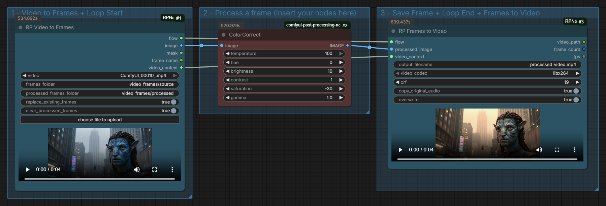

# ComfyUI RPNodes

A collection of utility nodes for ComfyUI:

- **Image sizing and resizing:** `Smart Image Size` and `Smart Image Resize`
- **Video frame processing:** `RP Video to Frames` and `RP Frames to Video`

## Image sizing and resizing

Paired nodes for model-aware image dimensions, sharing the same resolution
database and dependent controls.

### Supported models

- Boogu-Image-0.1 Base / Edit
- Boogu-Image-0.1 Turbo
- FireRed-Image-Edit-1.0
- FLUX.2 Klein
- HiDream-O1-Image / Dev
- Ideogram 4
- Krea 2
- Qwen-Image-2512
- Qwen-Image-Edit-2511
- SDXL
- Z-Image-Turbo

### Smart Image Size


Selects a model, a supported resolution class, and an aspect-ratio preset. It
is useful for configuring latent-image nodes, samplers, image generators, and
other nodes that require explicit width and height values.

#### Outputs

- `width` - selected width in pixels
- `height` - selected height in pixels
- `aspect_ratio` - selected ratio, such as `16:9`
- `resolution` - numeric square-side resolution

### Smart Image Resize


Accepts an image, a mask, or both and adapts them to dimensions suitable for
the selected model. When only a mask is connected, the node also creates a
three-channel preview image from that mask.

The optional `resolution` input accepts an integer longer-side value from nodes
such as `ImageSize (LongerSide)`. When connected, Smart Image Resize preserves
that longer-side resolution while calculating the other side from the selected
aspect ratio.

#### Selection modes

- `automatic` - selects the available preset whose aspect ratio is closest to
  the connected image or mask. The dimensions, width, and height controls are
  disabled in the interface.
- `manual` - allows direct preset selection and editable width and height
  values.

#### Outputs

- `IMAGE`
- `width`
- `height`
- `aspect_ratio`
- `resolution`
- `mask`

## Video frame processing

Paired nodes for extracting, processing, and rebuilding videos frame by frame.



### RP Video to Frames

Extracts a video to persistent PNG frames and starts the integrated processing
loop.

### RP Frames to Video

Saves the processed frames and rebuilds the MP4, with optional source audio and
an in-node preview.

### Connecting the pair

- `flow` to `flow`
- `video_context` to `video_context`
- `image` through the processing nodes to `processed_image`

Source and processed frames remain accessible under `ComfyUI/output`. FFmpeg is
provided through the package requirements.

## Installation

Open a terminal in `ComfyUI/custom_nodes` and run:

```bash
git clone https://github.com/raffaele-pet/ComfyUI-RPNodes.git
python -m pip install -r ComfyUI-RPNodes/requirements.txt
```

Restart ComfyUI and refresh the browser. The image-sizing nodes are available
under `image/resolution`; the video-processing nodes are available under
`video/RPNodes`.

## Example workflows

The [`example_workflows`](./example_workflows) directory contains one ready-to-use
workflow for each pair:

- [`smart-image-size-resize.json`](./example_workflows/smart-image-size-resize.json)
- [`video-frames-process-video.json`](./example_workflows/video-frames-process-video.json)

Drag a JSON file onto the ComfyUI canvas or load it through the workflow menu.

## Notes

- The resolution database includes both manufacturer-published presets and
  practical model-aware dimensions for additional aspect ratios.
- Very wide or tall formats may be less stable than a model's native training
  ratios.
