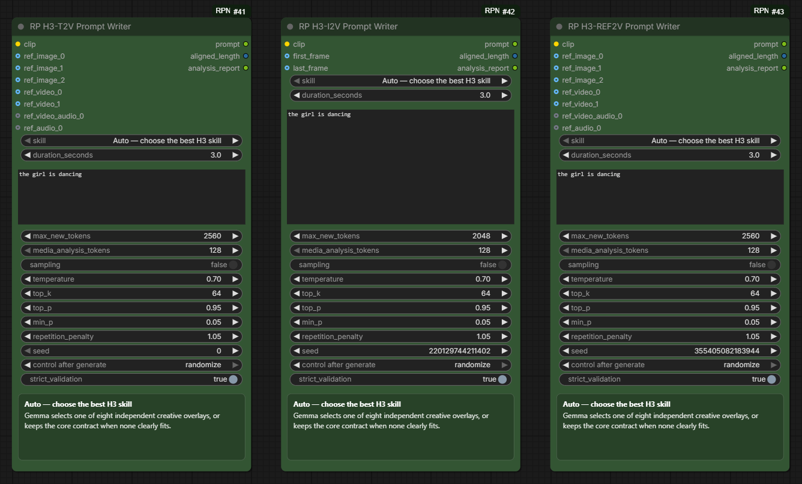

# ComfyUI RPNodes

A collection of utility nodes for ComfyUI:

- **Image sizing and resizing:** `RP Smart Image Size`, `RP Smart Image Resize`,
  and `RP Image Minimum 1K`
- **Video frame processing:** `RP Video to Frames` and `RP Frames to Video`
- **MiniMax H3 prompt writing:** `RP H3-I2V Prompt Writer` and
  `RP H3-REF2V Prompt Writer`

Python nodes are grouped in `image_sizing_and_resizing` and
`video_frame_processing`, with the H3 prompt-writing nodes in
`minimaxh3_prompt_writer`. Shared browser extensions live under `web`, and all
example workflows remain together in `example_workflows`.

## Image sizing and resizing

`RP Smart Image Size` and `RP Smart Image Resize` share the same model-aware
resolution database and dependent controls.

### Supported models

- Boogu-Image-0.1 Base / Edit
- Boogu-Image-0.1 Turbo
- FireRed-Image-Edit-1.0
- FLUX.2 Klein
- HiDream-O1-Image / Dev
- Ideogram 4
- Krea 2
- Qwen-Image-2512
- Qwen-Image-Edit-2511
- SDXL
- Z-Image-Turbo

### RP Smart Image Size


Selects a model, a supported resolution class, and an aspect-ratio preset. It
is useful for configuring latent-image nodes, samplers, image generators, and
other nodes that require explicit width and height values.

#### Outputs

- `width` - selected width in pixels
- `height` - selected height in pixels
- `aspect_ratio` - selected ratio, such as `16:9`
- `resolution` - numeric square-side resolution

### RP Smart Image Resize


Accepts an image, a mask, or both and adapts them to dimensions suitable for
the selected model. When only a mask is connected, the node also creates a
three-channel preview image from that mask.

The optional `resolution` input accepts an integer longer-side value from nodes
such as `ImageSize (LongerSide)`. When connected, RP Smart Image Resize preserves
that longer-side resolution while calculating the other side from the selected
aspect ratio.

#### Selection modes

- `automatic` - selects the available preset whose aspect ratio is closest to
  the connected image or mask. The dimensions, width, and height controls are
  disabled in the interface.
- `manual` - allows direct preset selection and editable width and height
  values.

#### Outputs

- `IMAGE`
- `width`
- `height`
- `aspect_ratio`
- `resolution`
- `mask`

### RP Image Minimum 1K

Upscales images whose longer side is below 1024 px while preserving their
aspect ratio. Images already at or above 1024 px remain unchanged.

## Video frame processing

Paired nodes for extracting, processing, and rebuilding videos frame by frame.


### RP Video to Frames

Extracts a video to persistent PNG frames and starts the integrated processing
loop.

### RP Frames to Video

Saves the processed frames and rebuilds the MP4, with optional source audio and
an in-node preview.

### Connecting the pair

- `flow` to `flow`
- `video_context` to `video_context`
- `image` through the processing nodes to `processed_image`

Source and processed frames remain accessible under `ComfyUI/output`. FFmpeg is
provided through the package requirements.

## MiniMax H3 prompt writing

Two Gemma-powered nodes turn a plain-language request and optional media into a
structured MiniMax H3 prompt. They preserve the official H3 mode contracts,
media-reference labels, integer-second timeline, audio sections, and 7,000
character limit.



### Required model and CLIP wiring

Place `gemma4_e4b_it_fp8_scaled.safetensors` in
`ComfyUI/models/text_encoders`, load it with a dedicated `Load CLIP` node using
type `stable_diffusion`, and connect that CLIP to the prompt writer.

The prompt writer and the H3 generation node require two different CLIP
connections:

- Gemma 4 CLIP -> `RP H3-I2V Prompt Writer` or
  `RP H3-REF2V Prompt Writer`
- H3 Qwen3-VL CLIP, loaded with type `minimax` -> the native MiniMax H3 node

Do not reuse the H3 Qwen3-VL CLIP for prompt writing or the Gemma CLIP for H3
generation.

### RP H3-I2V Prompt Writer

Writes the correct base prompt for the connected keyframes:

| Connected media | H3 mode | Picture mapping |
| --- | --- | --- |
| no frame | T2VA | no picture reference |
| `first_frame` | I2VA | `<Picture 1>` is the first frame |
| both frames | FL2VA | `<Picture 1>` is first and `<Picture 2>` is last |
| `last_frame` only | L2VA | `<Picture 1>` is the last frame |

### RP H3-REF2V Prompt Writer

Builds the six-section Reference-to-Video prompt from up to three images, two
video frame batches, one soundtrack paired with `ref_video_0`, and one
standalone audio reference. Only connected inputs receive native labels, so
the numbering remains contiguous even when earlier sockets are empty.

With every input connected, the mapping is:

```text
ref_image_0       -> <Picture 1>
ref_image_1       -> <Picture 2>
ref_image_2       -> <Picture 3>
ref_video_audio_0 -> <Audio 1>
ref_video_0       -> <Video 1>
ref_video_1       -> <Video 2>
ref_audio_0       -> <Audio 2>
```

Reference videos are accepted as `IMAGE` frame batches at 24 fps. The paired
soundtrack is connected separately to `ref_video_audio_0`.

### Shared controls and outputs

- `skill` applies the core H3 contract and optionally one of eight independent
  production profiles; `Auto` asks Gemma to select a profile only when one
  clearly fits.
- `duration_seconds` defaults to `3.0` and accepts whole seconds. The
  `aligned_length` output applies the official expression
  `max(5, round(seconds * 24)) + (5 - (max(5, round(seconds * 24)) % 17)) % 17`.
- `prompt` accepts the raw request in any language. Structural output is
  English, while requested dialogue, lyrics, and visible text remain verbatim.
- `strict_validation` checks structure, reference labels, timestamps, required
  audio fields, and length; it performs one repair pass before failing loudly.
- Outputs are `prompt`, `aligned_length`, and a JSON `analysis_report` for
  auditing the selected mode, skill, media mapping, and validation result.

Connect `prompt` and `aligned_length` to the corresponding inputs of the native
MiniMax H3 node. The implementation has no additional Python dependency beyond
ComfyUI. Source attribution and licensing details are available in
[`UPSTREAM_SOURCES.md`](./minimaxh3_prompt_writer/UPSTREAM_SOURCES.md),
[`THIRD_PARTY_NOTICES.md`](./minimaxh3_prompt_writer/THIRD_PARTY_NOTICES.md),
and the component [`LICENSE`](./minimaxh3_prompt_writer/LICENSE).

## Installation

Open a terminal in `ComfyUI/custom_nodes` and run:

```bash
git clone https://github.com/raffaele-pet/ComfyUI-RPNodes.git
python -m pip install -r ComfyUI-RPNodes/requirements.txt
```

Restart ComfyUI and refresh the browser. The image-sizing nodes are available
under `image/resolution`; the video-processing nodes are available under
`video/RPNodes`; the MiniMax H3 prompt writers are available under
`RP/MiniMax H3`.

## Example workflows

The [`example_workflows`](./example_workflows) directory contains ready-to-use
workflows for each node category:

- [`smart-image-size-resize.json`](./example_workflows/smart-image-size-resize.json)
- [`video-frames-process-video.json`](./example_workflows/video-frames-process-video.json)
- [`MiniMax H3 Prompt Writer.json`](./example_workflows/MiniMax%20H3%20Prompt%20Writer.json)

Drag a JSON file onto the ComfyUI canvas or load it through the workflow menu.

## Notes

- The resolution database includes both manufacturer-published presets and
  practical model-aware dimensions for additional aspect ratios.
- Very wide or tall formats may be less stable than a model's native training
  ratios.
