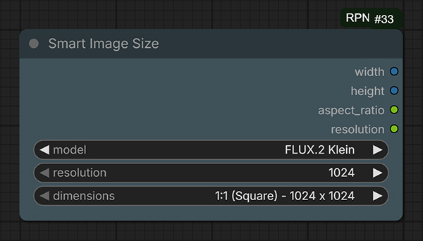
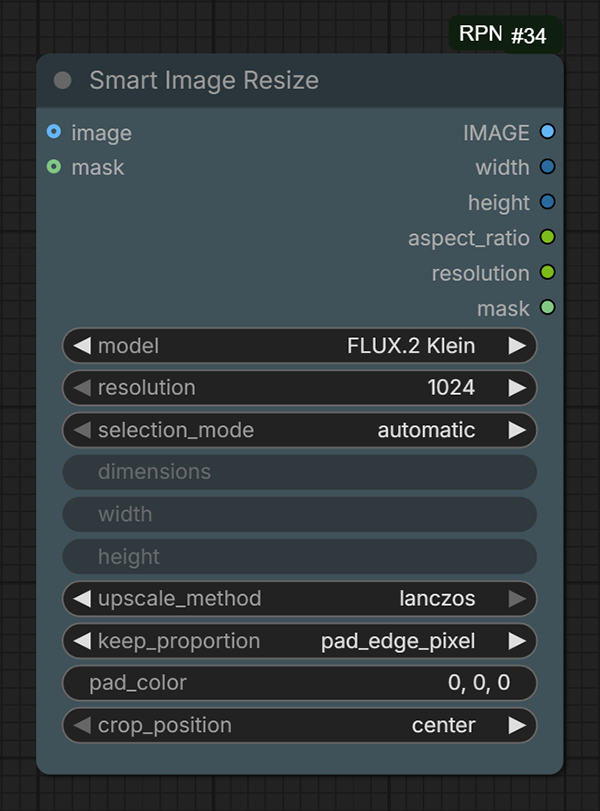
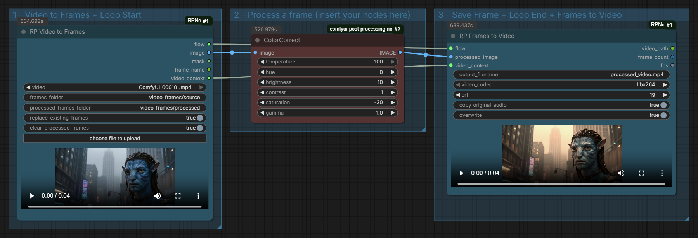

# ComfyUI RPNodes

A collection of utility nodes for ComfyUI:

- **Image sizing and resizing:** `RP Smart Image Size`, `RP Smart Image Resize`,
  and `RP Image Minimum 1K`
- **Video frame processing:** `RP Video to Frames` and `RP Frames to Video`
- **MiniMax H3 prompt writing:** `RP H3-T2V Prompt Writer`,
  `RP H3-I2V Prompt Writer`, and `RP H3-REF2V Prompt Writer`
- **MiniMax H3 keyframing:** `RP H3-Keyframes`

Python nodes are grouped in `image_sizing_and_resizing` and
`video_frame_processing`, with the H3 prompt-writing nodes in
`minimaxh3_prompt_writer` and the keyframe node in `h3_keyframes`. Shared
browser extensions live under `web`, and all example workflows remain together
in `example_workflows`.

## Image sizing and resizing

`RP Smart Image Size` and `RP Smart Image Resize` share the same model-aware
resolution database and dependent controls.

### Supported models

- Boogu-Image-0.1 Base / Edit
- Boogu-Image-0.1 Turbo
- FireRed-Image-Edit-1.0
- FLUX.2 Klein
- HiDream-O1-Image / Dev
- Ideogram 4
- Krea 2
- Qwen-Image-2512
- Qwen-Image-Edit-2511
- SDXL
- Z-Image-Turbo

### RP Smart Image Size



Selects a model, a supported resolution class, and an aspect-ratio preset. It
is useful for configuring latent-image nodes, samplers, image generators, and
other nodes that require explicit width and height values.

#### Outputs

- `width` - selected width in pixels
- `height` - selected height in pixels
- `aspect_ratio` - selected ratio, such as `16:9`
- `resolution` - numeric square-side resolution

### RP Smart Image Resize



Accepts an image, a mask, or both and adapts them to dimensions suitable for
the selected model. When only a mask is connected, the node also creates a
three-channel preview image from that mask.

The optional `resolution` input accepts an integer longer-side value from nodes
such as `ImageSize (LongerSide)`. When connected, RP Smart Image Resize preserves
that longer-side resolution while calculating the other side from the selected
aspect ratio.

#### Selection modes

- `automatic` - selects the available preset whose aspect ratio is closest to
  the connected image or mask. The dimensions, width, and height controls are
  disabled in the interface.
- `manual` - allows direct preset selection and editable width and height
  values.

#### Outputs

- `IMAGE`
- `width`
- `height`
- `aspect_ratio`
- `resolution`
- `mask`

### RP Image Minimum 1K

Upscales images whose longer side is below 1024 px while preserving their
aspect ratio. Images already at or above 1024 px remain unchanged.

## Video frame processing

Paired nodes for extracting, processing, and rebuilding videos frame by frame.



### RP Video to Frames

Extracts a video to persistent PNG frames and starts the integrated processing
loop.

### RP Frames to Video

Saves the processed frames and rebuilds the MP4, with optional source audio and
an in-node preview.

### Connecting the pair

- `flow` to `flow`
- `video_context` to `video_context`
- `image` through the processing nodes to `processed_image`

Source and processed frames remain accessible under `ComfyUI/output`. FFmpeg is
provided through the package requirements.

## MiniMax H3 prompt writing

Three Gemma-powered nodes turn a plain-language request and optional media into
a structured prompt for MiniMax H3 video generation.

The bundled workflow presents the three prompt writers side by side
and includes compact English and Italian Markdown notes with the repository
link.

### RP H3-T2V Prompt Writer

Creates a standalone text-to-video prompt. Optional images, video frame batches,
and audio help Gemma describe appearance, motion, and sound, but the final prompt
contains no Picture, Video, Audio, Subject, reference, or socket tags. Reference
inputs grow automatically up to 9 images, 3 videos, 3 paired soundtracks, and 3
standalone audio clips. Every visual input receives a corresponding timed
Storyboard contribution in the finished prompt.

### RP H3-I2V Prompt Writer

Creates an I2V prompt from one to nine ordered images, with frame inputs growing
automatically as they are connected. With `RP H3-Keyframes` it supports
multiframe generation. Without `RP H3-Keyframes` it works as a standard
first/last-frame prompt writer; connect the same one or two images to the native
H3 first/last-frame inputs. The global prompt is replaced by `prompt_1` through
`prompt_9` in the same UI position, before the advanced parameters. Every
connected `frame_N` reveals and requires its matching non-empty `prompt_N`
field. Gemma permanently binds each prompt, its protected dialogue/text, and
the analyzed image to `<Picture N>`. The frontend migrates both historical
widget layouts by name and splits an old numbered `1. ... 9.` request into the
matching prompt fields without shifting any parameter.
All rows become one continuous chronological `[Shot 1]`, preserving identity,
space, action, and camera motion. A later Shot is allowed only when a `prompt_N`
explicitly requests a cut, scene/location change, or time jump.

### RP H3-REF2V Prompt Writer

Creates a Reference-to-Video prompt from connected reference images, video
frame batches, paired video audio, and standalone audio while keeping MiniMax's
Picture, Video, and Audio labels consistent. Its reference inputs grow to the
same native H3 limits and retain their canonical order when nodes are copied or
pasted. Reference media is not passed through: connect each source separately
to this writer and to `MiniMax H3 Reference to Video`. Every connected source
must contribute in the narrative or sound sections, not only in metadata.

T2V uses contiguous second-based Storyboard ranges; REF2V timestamps later
shots. `duration_seconds` drives both prompt timing and the H3-compatible
`aligned_length`.

All three nodes use a dedicated `gemma4_e4b_it_fp8_scaled.safetensors` CLIP
loaded as `stable_diffusion`. The native H3 generation node must keep its
separate Qwen3-VL CLIP loaded as `minimax`. Their outputs are the generated
`prompt`, the H3-compatible `aligned_length`, and an `analysis_report`. Each
connected image, video, or audio asset is analyzed independently so every input
has its own traceable observation. The shared defaults are `max_token_length =
2048`, `media_analysis_tokens = 256`, and fixed `seed = 42`.
After writing the prompt, the nodes offload their dedicated Gemma CLIP before
downstream H3 generation to release VRAM.

## MiniMax H3 keyframes

### RP H3-Keyframes

Adds an ordered sequence of still images to MiniMax H3 conditioning without
manual position controls. The connected images are distributed automatically
across the exact length of the H3 AV latent.

The image inputs grow automatically. The node initially shows
`frame_1`; connecting it reveals `frame_2`, and the sequence
continues up to 32 images. Each input accepts one still image rather than an
image batch. The `crop` option either stretches each image to the target canvas
or applies a centered cover crop before VAE encoding.

Typical wiring is:

1. Connect the H3 conditioning and AV latent to `conditioning` and `latent`.
2. Connect the MiniMax H3 video VAE to `vae`.
3. Connect the still images in their intended order, then send the output
   conditioning to the sampler path.

The node replaces the conditioning's keyframe list with the connected images
in input order.

## Installation

Open a terminal in `ComfyUI/custom_nodes` and run:

```bash
git clone https://github.com/raffaele-pet/ComfyUI-RPNodes.git
python -m pip install -r ComfyUI-RPNodes/requirements.txt
```

Restart ComfyUI and refresh the browser. The image-sizing nodes are available
under `image/resolution`; the video-processing nodes are available under
`video/RPNodes`; all MiniMax H3 nodes are available under `RP/MiniMax H3`.

## Example workflows

The [`example_workflows`](./example_workflows) directory contains ready-to-use
workflows for each node category:

- [`smart-image-size-resize.json`](./example_workflows/smart-image-size-resize.json)
- [`video-frames-process-video.json`](./example_workflows/video-frames-process-video.json)
- [`minimax-h3-prompt-writer.json`](./example_workflows/minimax-h3-prompt-writer.json)

Drag a JSON file onto the ComfyUI canvas or load it through the workflow menu.

## Notes

- The resolution database includes both manufacturer-published presets and
  practical model-aware dimensions for additional aspect ratios.
- Very wide or tall formats may be less stable than a model's native training
  ratios.
